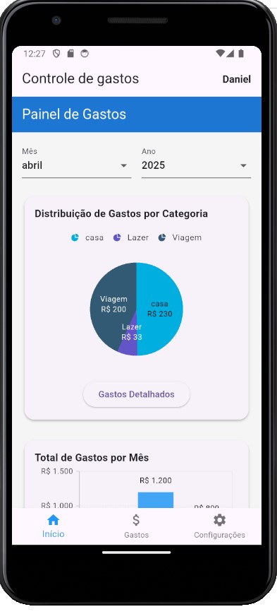
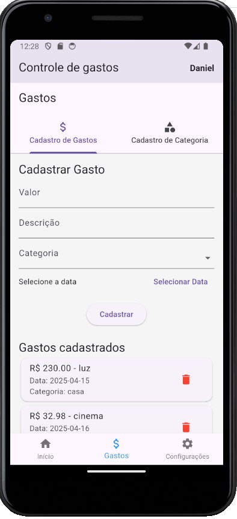
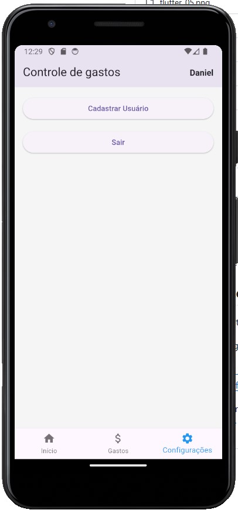
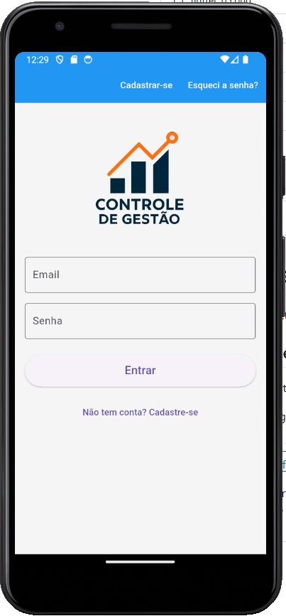

# 💸 App de Controle de Gastos

Aplicação desenvolvida para **gerenciamento financeiro pessoal**, com foco em organização dos **gastos mensais e anuais**, categorização de despesas e controle detalhado dos registros.

Este projeto foi construído com **FastAPI** no backend e **SQLite** como banco de dados principal, garantindo leveza, praticidade e fácil integração local.

---

## 🔧 Tecnologias Utilizadas

- **FastAPI** — API leve, rápida e fácil de manter
- **SQLite** — Banco de dados local e eficiente
- **Pydantic** — Validação de dados
- **SQLAlchemy** — ORM para modelagem das tabelas
- **Python 3.11+**

---

## 📷 Imagens da Aplicação

### 🟢 Tela Inicial
Aqui o usuário visualiza um resumo geral dos gastos do mês e do ano.

---

### 📝 Aba de Gastos
Permite registrar novos gastos, consultar por categoria, mês ou ano e visualizar valores totais.

---

### ⚙️ Configurações
Nesta seção o usuário pode cadastrar e editar categorias, além de configurar preferências da aplicação.

---

### 🔐 Tela de Login
Tela inicial de autenticação simples para proteger o acesso aos dados financeiros.

---

## 🧠 Funcionalidades

- Cadastro de categorias personalizadas
- Registro de gastos com valor, descrição, data e categoria
- Filtros por mês, ano e categoria
- Dashboard com resumo financeiro
- Autenticação básica (futura integração com JWT ou OAuth2)

---

## 🗂️ Estrutura do Projeto (Backend)

